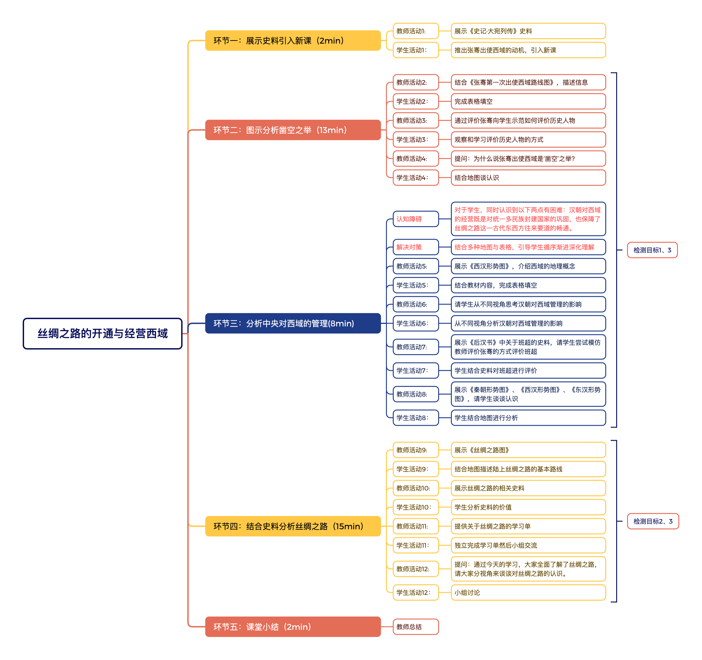

# REAL 备课搭子 ｜ 中小学教师备课提示词生成器

> 不会写提示词，也能让 AI 听懂你的班。
> 你负责作出教学判断，工具负责把这些判断整理成 AI 听得懂的任务书。

一个**单文件、无需安装、页面可离线运行**的备课提示词生成器：老师跟着页面完成 8 组专业选择，即可自动生成一条结构完整的 **REAL 备课提示词**，发给 DeepSeek 等大模型即可获得贴合本班学情的教学设计初稿；发给 WorkBuddy 等智能体，还能直接生成带「课堂教学思维结构」图的 Word 文档。

---

## 为什么做这个工具

输入一句"请帮我设计一份教学方案"，AI 很快写出几千字：目标完整、环节齐全、语言流畅——可仔细一看，还是不能用。

不是 AI 不够聪明。同一个课题，面对不同年级、不同班级、不同教师，本来就不该得到同一份教学设计。AI 不知道你的学生卡在哪里，不知道你使用哪个版本的教材，也不知道这节课你最想解决的是情境创设、问题设计，还是小组合作流于形式。

**当我们只给 AI 一个课题名称，它只能写出一份"看起来都对，放到具体班级里却往往不够合用"的通用教学设计。** 问题不只是提示词写得不够漂亮，而是备课需要的专业信息没有被带进对话。

备课搭子把这件事藏在一组选择题后面：**每一次勾选，都是教师在告诉 AI——我要解决什么问题，依据什么材料，交付什么结果，又有哪些边界不能越过。**

## 功能特性

- **8 组引导式选择，不写一句提示词**：学校与学段学科 → 教材版本与课题 → 班级学情 → 研究要素 → 名师风格 → 输出格式 → 证据材料 → 白板平台；
- **教材版本下拉选择**：统编教材及人教、北师大、苏教、外研、译林等 40+ 主流版本（详见文末速查表），选不准可自填；
- **学情按学科自动出题**：选择学科后，学情选项自动匹配该学科的典型学习困难，另有"口述补充"自由填写；
- **内置六个课堂研究杠杆**：情境创设 / 问题设计 / 小组合作 / 表达倾听 / 交流反思 / 当堂检测，可另选"其他（自填）"——"设计一节好课"太宽泛，好课需要更下位的抓手：每次备课聚焦 1—2 个杠杆，就是好课真正的落点；
- **名师风格池（可选）**：按学段×学科匹配公开教学名家，附课例视频搜索入口。名师池的意义不是模仿，而是**榜样的引领**——每位教师都值得培养：哪怕没有荣誉等身，也可以在名家课例与风格参照中发掘自身优势，逐步形成自己的教学风格，成为充满自信、热爱职业、卓越而平凡的老师；
- **输出 REAL 四要素结构**：R（角色）· E（情境与证据）· A（行动）· L（限制）；
- **自动生成自检清单**：提示词生成后自动核验关键项是否齐全；
- **一键复制全文**：粘贴到任何大模型即可使用，工具与平台无关。建议直接发给 WorkBuddy 等智能体，要求直接生成可下载的 Word 文档。

## 设计底层

- **REAL 结构化提示词模型**（2025 年 12 月研发）：角色、情境与证据、行动、限制——给 AI 员工写的一份"工作交接单"；
- **UBD 逆向设计**：先想清楚学生最终要学会什么、用什么证据判断学习是否发生，再安排课堂活动、评价和作业；
- **三感课堂**：不只追求"内容讲完"，还关注学生在学习过程中有没有安全感、愉悦感和意义感。

## 快速开始

1. 下载 `index.html`（本仓库唯一需要的文件）；
2. **双击打开**——不需要安装、不需要注册，页面可离线运行；
3. 按页面引导完成选择，点击"**生成备课提示词**"；
4. 点击"**复制全文**"，粘贴到您使用的大模型或智能体，发送；
5. 拿到初稿后用"**三问验收**"：①能用吗？②AI 做对了什么？③我还要改什么？再决定 0—5 轮追问优化。

> 最短可用路径只有五步：**学段学科 → 课题课时 → 三项核心学情 → 一个研究要素 → 生成**。其余选项都是加分项，可跳过。
>
> 课程标准不用上传（智能体自行检索现行版本核对引用）；但**教材照片必须随提示词一并上传**（网络无可靠电子版）。您需要提供的只有三样：课题 ＋ 班级学情 ＋ 教材照片（最好覆盖一个单元）。

## 双内置教学设计模板

| | 简化版 | 完整版 |
|---|---|---|
| 结构 | 十章节＋四附录 | 十二章节＋四附录 |
| 课堂教学思维结构 | 不含 | **含**（见下） |
| 教学反思 | 不含 | **含**（成长型思维双表） |
| 适用 | 赶时间、快速成稿 | 磨课、研究课、深度备课 |

学校已有自己的教学设计模板？把章节结构贴进"校本模板"栏，工具按校本要求生成。

**四个附录对应四个备课动作**：学习任务设计表（把任务列清楚）· 五类问题设计（识记/理解/发散/评价/管理）· 本节课 AI 技术应用建议（涉及资源仅提供"平台名称＋搜索关键词"（优先国家智慧教育平台），不虚构链接；表下备注：教学设计可直接发给智能体协助实现任一条建议）· 电子白板/教学平台使用建议；作业按"基础—挑战—实践"三层组织，照顾不同学习起点。附录的另一层价值：让教师的日常备课与学校数智化转型自然连接——不是先组织庞大的通用培训再等迁移，而是把建议落到具体任务、课堂环节和工具选择上，**边用边学，降低培训的时间成本和学习成本**。

## 设计特色一：课堂教学思维结构（一节课的"施工蓝图"）

完整版模板第八部分生成「课堂教学思维结构」——原型来自 2011 年一项上海市级课题研究，在教研员与校长岗位的实践中持续迭代：

- 每个环节有**预估用时**；
- 每个环节含若干组**"教学行为对"**（教师活动 ↔ 学生活动）；
- 重、难点环节附**认知障碍及解决对策**分析；
- 标明哪个环节**检测哪个教学目标**，体现"教学评一致性"。

**双轨输出**：WorkBuddy 等智能体可直接把结构渲染为向右逻辑图嵌入 Word 文档（图下自带修改规则：编辑文末「课堂教学思维结构」图源码，发回智能体即可重新出图，无需 XMind）；纯文本模型则输出 MD 代码块，可导入 XMind 生成。

### 样例

以下为初中历史《丝绸之路的开通与经营西域》的真实样例：



## 设计特色二：成长型思维教学反思（每天几分钟，成长很轻松）

第十二部分不是普通的"课后小结"，而是一套**轻量级的成长型思维训练装置**——不让老师写长反思，只填两张表：

**表一「😊 这堂课的满意之处」**
> 怕什么真理无穷，进一寸有进一寸的欢喜。

| 序号 | 现象 | 归因 | 怎样保持？向哪儿迁移？ |
|---|---|---|---|
| 1 | （课后填） | （课后填） | （课后填） |

**表二「🤔 这堂课中，我还没做好的……」**
> 只要不变成习惯，失败是件好事。

| 序号 | 现象 | 归因 | 对策或行动 |
|---|---|---|---|
| 1 | （课后填） | （课后填） | （课后填） |

**优点要归因并迁移，问题要归因并改进。** AI 只输出表格结构、引语与空行，绝不编造课堂效果——真正发生在课堂里的判断，仍然由上课的教师完成。

## 使用边界

1. 网页工具本身可离线运行；但把生成的提示词提交给大模型或智能体时，需要联网，并遵守所用平台的数据规则；
2. 不要输入学生姓名、联系方式、完整成绩表等敏感信息；
3. AI 生成的是**初稿**，不是定稿——学科准确性、学情适切性和课堂可行性，最终仍需教师审核。

## 支持的教材版本（第 2 题下拉选择）

**统编三科（全国统一，只此一版）**

| 学段 | 学科 |
|---|---|
| 小学·初中 | 语文、道德与法治、历史（统编版/部编版） |
| 高中 | 语文、思想政治、历史（统编版） |

**小学**

| 学科 | 主流版本 |
|---|---|
| 数学 | 人教版、北师大版、苏教版、西师大版、冀教版、青岛版、沪教版、北京版 |
| 英语 | 人教PEP、外研版（一起/三起）、译林版、沪教牛津版、北师大版、闽教版、湘少版、北京版、陕旅版、重大版 |
| 科学 | 教科版、苏教版、青岛版、冀人版、湘科版、大象版、人教鄂教版 |
| 音乐 | 人音版、人教版、湘艺版、花城粤教版、苏少版 |
| 美术 | 人美版、人教版、湘美版、苏少版、岭南版、赣美版 |

**初中**

| 学科 | 主流版本 |
|---|---|
| 数学 | 人教版、北师大版、苏科版、沪科版、浙教版、湘教版、华师大版、冀教版、青岛版 |
| 英语 | 人教版、外研版、译林版、沪教牛津版、北师大版、仁爱版、冀教版 |
| 物理 | 人教版、北师大版、苏科版、沪科版、教科版、沪粤版 |
| 化学 | 人教版、沪教版、科粤版、鲁教版 |
| 生物 | 人教版、北师大版、苏教版、济南版、冀少版 |
| 地理 | 人教版、中图版、湘教版、商务星球版、粤教粤人版 |
| 信息科技 | 教科版、浙教版及各地新版（2022课标后修订中） |

**高中**

| 学科 | 主流版本 |
|---|---|
| 数学 | 人教A版、人教B版、北师大版、苏教版、湘教版 |
| 英语 | 人教版、外研版、译林版、北师大版、重大版 |
| 物理 | 人教版、教科版、沪科版、鲁科版、粤教版 |
| 化学 | 人教版、鲁科版、苏教版 |
| 生物 | 人教版、苏教版、浙科版 |
| 地理 | 人教版、中图版、湘教版、鲁教版 |
| 信息技术 | 教科版、人教中图版、粤教版、浙教版、沪教版 |

## 技术说明

- 单个 HTML 文件，HTML + CSS + 原生 JavaScript，无框架、无构建、无外部请求；
- 兼容 Chrome / Edge / Safari 等现代浏览器；支持投影大屏与机房批量分发（U 盘拷贝即可）；
- 完全本地运行，不收集任何填写内容；
- 名师风格描述整理自公开教学资料，仅供备课学习参考。

## 校本化建议

当前开源的是面向不同学校和教师的通用版本。实际使用时，一所学校可以根据本校的教材版本、常用模板、学情选项和平台环境，固定或调整部分信息，让"备课搭子"更便捷、更贴合校本需求。欢迎通过 Issue 反馈使用中的建议和具体需求。

## 文件结构

```
├── index.html   # 备课搭子本体（双击即用）
├── README.md    # 本说明
├── LICENSE      # MIT
└── docs/        # 样例图等资源
```

## 为什么选择开源

这个工具和背后的教学设计模板，先后在四所学校的课堂实践和骨干教师培训中试用、打磨、迭代。选择开源，**不是因为它已经完美，而是因为一个教育工具只有进入更多真实课堂，才有机会继续生长。**

## 作者

**铝校长（吕彩玲）**——30 年基础教育经历，从教师、区域教研员到校长，从一堂课走到一所学校。REAL 结构化提示词模型提出者。

> 不会让 AI 替教师作决定，只想让它在最卡、最累、最容易重复劳动的地方搭把手——把时间还给教师，把判断留给教师。
> **用教育的眼光看 AI，辨别真问题，提供真方案。**

## License

MIT（欢迎学校与老师自由使用、二次开发，保留署名即可）

---

*如果这个小工具帮到了您，欢迎 Star；也欢迎通过 Issue 告诉我们：您教什么学科，最想让它继续解决哪一个备课难题？*
